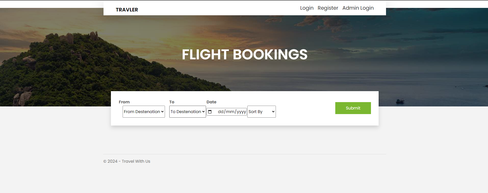

## Project ive made with collage partner in 2022 as part of Introduction to Computer Communications – Project —a website in MVC

# TravelAgency

HI,
Travel booking website on localhost.
In order to run the program you will need to:
 connect the project to YOUR database connection 
 change the connectionString in the web.config with your connection data 
install entity framework 
after that delete the mirgations folder
 and run the following commands in Package manager console
after every command press ENTER
 1. enable-mirgations
2. add-migration addTable
3. update-database -vervose 
these commands will build the table in YOUR database connection 

after that add admin manully in tblAdmin 
and you are ready to go!

## Screenshots

 

## Authors: 

Pavel Kormilchik kormilchikpavel@gmail.com

Orel Maier orelmaier@gmail.com